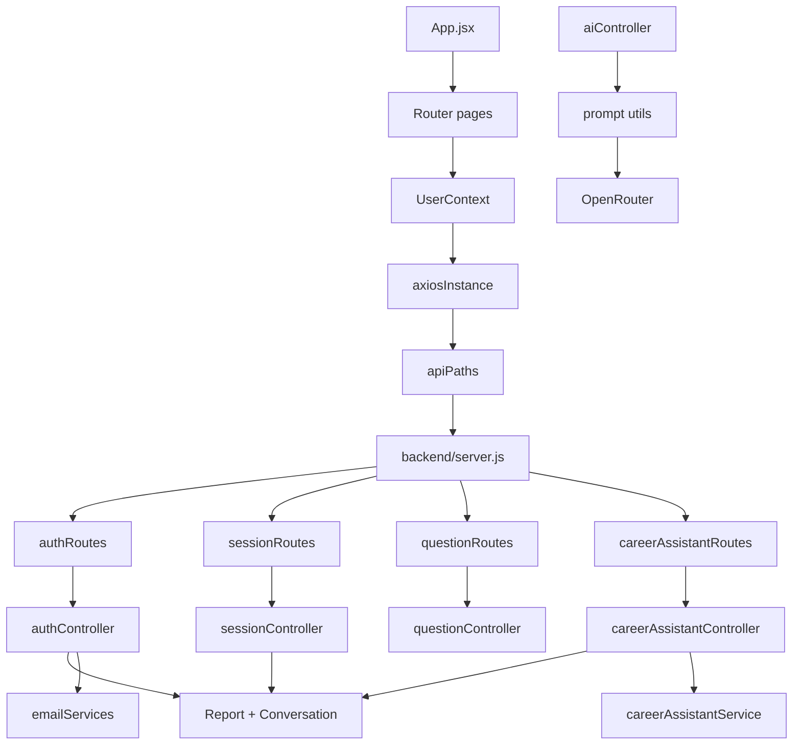

# InterviewPrep AI — Deep Study & AI Walkthrough (README)

> Exam-notes style documentation for how this project works **from beginning to end**, with diagrams, flowcharts, and “how to rebuild the same app” guidance.

---

## Table of Contents
1. Project Overview
2. Architecture Breakdown
3. Diagrams (Mermaid + ASCII)
4. Backend: Routes → Controllers → Models → Services
5. AI: How the LLM is used end-to-end
6. Frontend: State management + API consumption
7. Data Flow Walkthrough (User Journeys)
8. Learning Mode (Interview Q/A)
9. Debug & Improvement Checklist
10. Final Summary

---

## 1) Project Overview
### What the project does (simple)
**InterviewPrep AI** is a web app that helps users prepare for technical interviews by:
- generating role-based interview questions (AI)
- generating deep concept explanations (AI)
- storing everything in MongoDB so users can revisit and revise
- providing a “Career Assistant” that can review resumes/projects and run HR-style mock interviews
- optionally sending emails for onboarding/notifications

### Main features
- **Auth**: local signup/login (JWT + bcrypt) and Google login (Firebase token exchange)
- **Interview sessions**:
  - create sessions for a role + experience + topic focus
  - AI generates question/answer pairs
  - user can pin important questions and add notes
- **Concept learning drawer**: AI explanation on demand
- **Career assistant**:
  - Interview coach
  - Resume review (upload + parse)
  - Project review
  - Career roadmap advice
  - HR interviewer multi-turn chat (persistent)
- **Email notifications**: Brevo transactional emails

---

## 2) Architecture Breakdown
### Folder structure (high level)

#### Backend (Express)
- `backend/server.js`
- `backend/routes/`
  - `authRoutes.js`
  - `sessionRoutes.js`
  - `questionRoutes.js`
  - `careerAssistantRoutes.js`
- `backend/controllers/`
  - `authController.js`
  - `sessionController.js`
  - `questionController.js`
  - `aiController.js`
  - `careerAssistantController.js`
- `backend/models/` (Mongoose)
  - `User.js`
  - `Session.js`
  - `Question.js`
  - `CareerAssistantReport.js`
  - `CareerAssistantConversation.js`
- `backend/middlewares/`
  - `authMiddleware.js` (JWT protect)
  - upload middlewares (resume/image)
- `backend/services/`
  - `emailServices.js`
  - `careerAssistantService.js` (LLM workflows)
- `backend/utils/`
  - prompt builders

#### Frontend (React)
- `frontend/interview-prep-ai/src/App.jsx` (Router + page routing)
- `src/context/userContext.jsx` (auth state)
- `src/utils/axiosInstance.js` (JWT injection)
- `src/utils/apiPaths.js` (endpoint map)
- `src/pages/`
  - `Home/Dashboard.jsx`
  - `InterviewPrep/InterviewPrep.jsx`
  - `CareerAssistant/*`
- `src/components/` (cards/drawer/modal/etc)

---

## 3) Diagrams

### 3.1 System architecture diagram (Mermaid)
```mermaid
flowchart LR
  U[User] --> F[React Frontend (Vite)]
  F -->|Axios + JWT| B[Express Backend]
  B --> DB[(MongoDB + Mongoose)]
  B --> LLM[OpenRouter/OpenAI-compatible LLM]
  B --> E[Brevo Email Service]

  subgraph Frontend
    F1[Dashboard]
    F2[InterviewPrep]
    F3[CareerAssistant]
    FC[UserContext]
  end

  subgraph Backend
    R[Routes]
    C[Controllers]
    S[Services]
    M[Models]
    P[Prompt utils]
  end

  F1 --> B
  F2 --> B
  F3 --> B
  FC --> B
```

### 3.2 Main user journey flow (ASCII)
```
(1) Visit app
    |
    v
(2) UserContext loads token?
    |-- no --> Landing/Login
    |-- yes --> GET /api/auth/profile
                 |
                 v
             (3) Dashboard shows sessions
                 |
                 v
             (4) Create session
                 |
                 v
             POST /api/sessions/create
                 |
                 v
             (5) InterviewPrep: fetch session details
                 |
                 v
             GET /api/sessions/:id (populate questions)

             Loop per question:
               - Pin -> POST /api/questions/:id/pin
               - Learn more -> POST /api/ai/generate-explanation
               - Load more -> POST /api/ai/generate-questions
                                 then POST /api/questions/add

             Optional Career Assistant:
               - resume/project/career-advisor -> /api/career-assistant/*
               - HR interviewer -> /hr/start then /hr/answer
```

### 3.3 Module dependency graph (Mermaid concept map)


---

## 4) Backend: Routes → Controllers → Models → Services

### 4.1 JWT middleware
**File**: `backend/middlewares/authMiddleware.js`
- Reads `Authorization: Bearer <token>`
- `jwt.verify(token, JWT_SECRET)`
- Loads `User` from MongoDB
- attaches `req.user` for protected endpoints

### 4.2 Authentication
**Routes**: `backend/routes/authRoutes.js`
- `POST /api/auth/register`
- `POST /api/auth/login`
- `POST /api/auth/google` (Firebase)
- `GET /api/auth/profile` (protected)
- `POST /api/auth/upload-image` (upload middleware)
- `DELETE /api/auth/upload-image/:filename`

**Controller highlights** (`backend/controllers/authController.js`)
- Register:
  - validate name/email/password
  - bcrypt hash password
  - create user document
  - trigger emails (welcome + admin) “fire and forget”
- Login:
  - find user with `.select('+password')`
  - bcrypt compare
  - return JWT `{expiresIn: "7d"}`
- Google login:
  - verify Firebase ID token via Firebase Admin
  - create user if missing
  - set authProvider="google" and emailVerified=true

### 4.3 Sessions & Questions persistence
**Routes**:
- `POST /api/sessions/create`
- `GET /api/sessions/my-sessions`
- `GET /api/sessions/:id`
- `DELETE /api/sessions/:id`

**Controllers**:
- `backend/controllers/sessionController.js`
- `backend/controllers/questionController.js`

**Important storage model**
- `Session` stores:
  - user, role, experience, topicsToFocus, description
  - `questions: [ObjectId]`
- `Question` stores:
  - question text, answer text
  - `note` and `isPinned`
  - `session` back reference

### 4.4 AI endpoints (core)
**Routes (in** `backend/server.js`**):**
- `POST /api/ai/generate-questions` (protected)
- `POST /api/ai/generate-explanation` (protected)

**Controller**: `backend/controllers/aiController.js`
- calls OpenRouter through OpenAI-compatible client
- enforces strict JSON-only output

### 4.5 Career Assistant endpoints
**Routes**: `backend/routes/careerAssistantRoutes.js`
- interview-coach
- resume-review (upload resume)
- project-review
- career-advisor
- hr/start
- hr/answer

**Controller**: `backend/controllers/careerAssistantController.js`
- creates either:
  - `CareerAssistantReport` (one-off outputs)
  - `CareerAssistantConversation` (multi-turn HR)

---

## 5) AI: How the LLM is used end-to-end

### 5.1 What AI is used for (full list)
1. **Interview Questions Generator**
   - Generates question/answer pairs.
   - Uses a **strict JSON-only contract** (LLM output must parse as JSON).
2. **Concept Explanation Generator**
   - Explains a specific question with structured output.
   - Also uses strict JSON parsing.
3. **Career Assistant (LLM workflows)**
   - Resume review: upload → extract text → AI review.
   - Project review: architecture/code feedback generation.
   - Career advisor: roadmap suggestions based on skills.
   - Interview coach: coaching feedback generation.
4. **HR Interviewer (stateful multi-turn)**
   - Uses persistent conversation storage.
   - Each answer is evaluated and the next question is generated.

> NOTE: This section includes the “how to rebuild it” AI architecture, not just a description.

### 5.2 Where the AI calls happen (core)
- `backend/controllers/aiController.js` handles:
  - `POST /api/ai/generate-questions`
  - `POST /api/ai/generate-explanation`

- `backend/services/careerAssistantService.js` handles the domain-specific assistant workflows used by:
  - `backend/controllers/careerAssistantController.js`

### 5.3 Provider wiring (OpenRouter / OpenAI-compatible)
- The AI controller constructs an OpenRouter client via OpenAI-compatible interface:
  - `baseURL: "https://openrouter.ai/api/v1"`
  - `apiKey: process.env.OPENROUTER_API_KEY`
  - model: `openrouter/free`

### 5.4 Prompt contract (JSON-only) + parsing
In `backend/controllers/aiController.js`, the flow is:
1. Build prompt using prompt utils
2. Ask the LLM to return **ONLY valid JSON**
3. Strip possible ```json fences
4. `JSON.parse` the cleaned content
5. Return parsed object to frontend

**Why this is critical**
- The UI expects structured keys.
- If JSON is invalid, endpoints return 500.

### 5.5 Persistence strategy for AI outputs
- Q/A sessions:
  - questions are persisted in `Question` documents
  - session references question IDs
- Concept explanations:
  - returned to frontend for immediate display (not stored in DB in the shown flow)
- Career assistant:
  - `CareerAssistantReport` stores one-off outputs
  - `CareerAssistantConversation` stores multi-turn HR state

### 5.6 “Rebuild this app” AI blueprint (minimal steps)
1. Create protected AI endpoints (generate questions, generate explanations)
2. Enforce JSON output + validate/parse responses
3. Store outputs in DB for revision (sessions/questions)
4. For multi-turn chats, persist conversation state keyed by `(userId, conversationId)`
5. Keep prompts in dedicated prompt modules per domain
6. Add reliability: schema validation + retries + rate limiting

---

### 5.7 Original list continues (kept for consistency)
1. **Interview Questions Generator**
   - Input: role, experience, topicsToFocus, numberOfQuestions
   - Output: JSON list of question/answer pairs

2. **Concept Explanation Generator**
   - Input: one question string
   - Output: JSON explanation payload

3. **Career Assistant**
   - Resume review: upload → extract text → generate review
   - Project review: inputs + stack → generate code/architecture feedback
   - Career advisor: role/experience/skills → generate roadmap
   - Interview coach: input question → generate coaching feedback

4. **HR interviewer (stateful multi-turn)**
   - HR start: creates conversation state + first question
   - HR answer: evaluates user answer + produces next question

### 5.2 Where the AI calls happen (core)
**File**: `backend/controllers/aiController.js`
- Builds prompt via prompt utilities:
  - `../utils/prompt`
- Uses OpenRouter:
  - `baseURL: "https://openrouter.ai/api/v1"`
  - `apiKey: process.env.OPENROUTER_API_KEY`
  - `model: "openrouter/free"`

### 5.3 Prompt contract: JSON-only + parsing
**Key reliability design choice**
- The system prompt says: “Return ONLY valid JSON.”
- After receiving the response:
  - remove ```json fences if present
  - `JSON.parse`

**Why this matters**
This project treats AI like an API.
If JSON parsing fails, endpoints return 500.

### 5.4 AI workflows and persistence
- Questions:
  - Frontend calls AI endpoint, maps output → `{question, answer}`
  - persists via `/api/questions/add`
- Explanations:
  - return JSON to frontend drawer for immediate display
- Career assistant:
  - persist AI outputs as reports
  - persist HR turns as conversation messages

### 5.5 HR conversation state pattern (copy/paste blueprint)
For a new app:
1. Create conversation record on `hr/start`
2. Store:
   - userId
   - conversationId
   - currentQuestionIndex
   - messages[] history
3. For each `hr/answer`:
   - load conversation scoped by (userId, conversationId)
   - evaluate previous answer
   - update messages[previousIndex]
   - push next question message

---

## 6) Frontend: State management + API consumption

### 6.1 Auth state (UserContext)
**File**: `src/context/userContext.jsx`
- reads `localStorage.token`
- if present: `GET /api/auth/profile`
- exposes `{user, loading, updateUser, clearUser}`

### 6.2 Axios JWT injection
**File**: `src/utils/axiosInstance.js`
- request interceptor adds Authorization header
- response interceptor:
  - on 401 redirect to landing

### 6.3 Pages that use AI
- `pages/InterviewPrep/InterviewPrep.jsx`
  - Load more questions:
    - `POST /api/ai/generate-questions`
    - then `POST /api/questions/add`
  - Learn more:
    - `POST /api/ai/generate-explanation`

- `pages/CareerAssistant/*`
  - call assistant endpoints
  - HR mode sends conversationId + userAnswer per turn

---

## 7) Data Flow Walkthrough (detailed)

### 7.1 Load More AI questions
```
UI: InterviewPrep -> Load More button
  |
  v
POST /api/ai/generate-questions (role/exp/topics)
  |
  v
Backend: aiController.generateInterviewQuestions
  - build prompt
  - call LLM
  - JSON.parse
  |
  v
Front-end maps output -> [{question, answer}]
  |
  v
POST /api/questions/add
  |
  v
Backend: questionController.addQuestionsToSession
  - insert many Question docs
  - push ids into Session.questions
```

### 7.2 Learn more explanation
```
UI click Learn More
  |
  v
POST /api/ai/generate-explanation {question}
  |
  v
Backend: aiController.generateConceptExplanation
  - prompt
  - call LLM
  - parse JSON
  |
  v
Drawer shows explanation payload
```

---

## 8) Learning Mode (interview questions)

### Module: JSON-only AI contract
- Why enforce JSON-only?
- What happens when AI returns invalid JSON?
- How to validate AI output with schema (zod/joi)?
- How to add retries or “JSON repair”?

### Module: Multi-turn HR interviewer
- How do you persist conversation state?
- How do you prevent cross-user access to conversationId?
- How to handle message indexing safely?

### Module: Mongoose populate/sorting
- How does `.populate({ options: { sort } })` work?
- Why store `questions` as ObjectIds in `Session`?
- How to implement cascading deletes safely?

---

## 9) Debug & Improvement Checklist

### Observed/likely issues
- AI JSON parsing is strict; failures return 500.
- frontend sometimes optimistically updates state before refetch.
- rate limiting for AI endpoints is not shown (cost protection).

### Recommended improvements
- Add request validation (zod/joi) for all controllers.
- Add AI response schema validation (zod/joi after JSON.parse).
- Add retry/backoff for temporary LLM failures.
- Add caching if repeated prompts are common.
- Add rate-limits + audit logs.

### Career Roadmap “not working” — likely root causes (from code)
1) **Frontend expects a specific response shape**
   - `CareerAdvisorPage.jsx` renders:
     - `result.roadmap` (timeline)
     - `result.learningPath`
     - `result.skillGapAnalysis.gaps` and `result.skillGapAnalysis.whatToLearnNext`
     - `result.recommendedTechnologies`, `result.recommendedProjects`, etc.
2) **Backend Career Advisor contract must match exactly**
   - `careerAssistantPrompts.js` for `careerAdvisorPrompt` defines the exact JSON keys.
   - If the LLM returns malformed JSON or mismatched keys, `result.roadmap` becomes empty.
3) **Fix by logging + schema validation**
   - Temporarily log the raw AI JSON coming back from `generateCareerAdvisor()`.
   - Add a validator for the response keys before sending to frontend.
4) **Possible UI mapping bug**
   - In the page, timeline is:
     - `const timeline = Array.isArray(result?.roadmap) ? result.roadmap : [];`
   - So any mismatch (e.g., LLM returns `{ "timeline": ... }`) produces a blank UI without throwing.

Quick diagnostic checklist:
- Call `POST /api/career-assistant/career-advisor` with sample payload and inspect backend JSON response.
- Confirm response includes `roadmap`, `learningPath`, `skillGapAnalysis`, etc.
- If response is correct, check whether `CAREER_ASSISTANT_API.careerAdvisor` returns `res.data.data` or `res.data` (frontend currently does `res.data?.data || res.data`).

---

## 10) Final Summary
- Backend is Express + JWT-protected routes + Mongoose persistence.
- AI calls are centralized in `aiController` and `careerAssistantService`.
- The project relies on a strict JSON contract from the LLM.
- Interview sessions persist question/answer pairs and support pinning/notes.
- Career Assistant persists reports and HR multi-turn conversations.

---

### Diagrams pack included
- Mermaid architecture diagram
- Mermaid dependency graph concept map
- ASCII journey flowchart
- ASCII AI flow sub-charts


